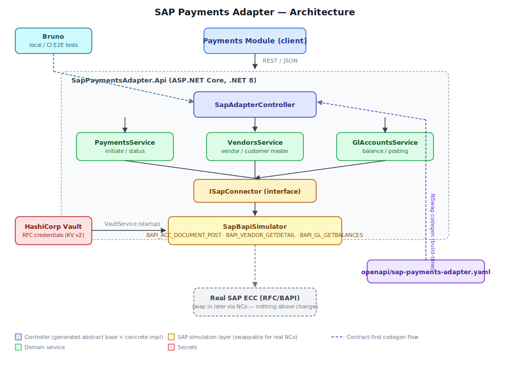

# SAP Payments Adapter — .NET / ASP.NET Core

REST facade over a bank's legacy SAP (ECC, RFC/BAPI-style) system, exposing
payment initiation/status, vendor/customer master, and GL account
balance/posting to downstream modules such as Payments. Built as hands-on
practice for a role doing exactly this, on top of the existing InsureFlow
.NET port (same DI/middleware/test conventions carried over).

## Architecture



Request flow: the Payments module (or any downstream consumer) calls
`SapAdapterController` → domain services (`PaymentsService`,
`VendorsService`, `GlAccountsService`) → `ISapConnector` →
`SapBapiSimulator` today, a real NCo-based implementation later without
anything above the interface changing. Vault feeds RFC credentials in at
startup; the OpenAPI spec feeds generated controller code in at build
time (contract-first, see "Why this design" below); Bruno drives E2E
tests against the running instance.

New to this codebase? **[docs/CODEBASE_GUIDE.md](docs/CODEBASE_GUIDE.md)**
walks through where to start reading, a full end-to-end request trace,
why there are three layers of tests, and what's actually been verified
versus still assumed.

## Status

`dotnet build` succeeds clean — API, unit tests, and integration tests all
compile on Windows with .NET 8 SDK + .NET 8/10 runtimes installed
side-by-side. `dotnet run` also succeeds end to end: the app starts,
fetches the SAP RFC credentials from Vault (confirmed via the masked
startup log lines), and listens on `http://localhost:5000`. `dotnet test`
now passes clean too — **11/11 tests, 0 failures** (both unit and
integration suites), confirming the vendor-not-found → 404 path, the
successful payment → SAP document number path, the blocked-vendor →
rejection-without-throwing path, and the GL balance lookup all work as
designed. The Bruno E2E run against a live instance is now fully green
too — **7/7 requests, 12/12 tests, 0 failures**, including full JWT
auth: `Get Dev Token` mints a token, and every subsequent request
(`Get Vendor`, `Get Balance`, `Post GL Entry`, `Initiate Payment`,
blocked-vendor rejection, and payment status lookup) authenticates
successfully and returns the expected status code. Getting here required
adding explicit `folder.bru` sequencing (Auth → seq 1, so the token gets
minted before anything that needs it) — the CLI's default folder
discovery order turned out not to be alphabetical as assumed, which
initially caused every protected request to run before the token existed
and fail with 401.

One environment gotcha found while running it: `dotnet run` defaults to
the **`Production`** environment, and `Program.cs` only enables Swagger UI
under `Development`:
```csharp
if (app.Environment.IsDevelopment())
{
    app.UseSwagger();
    app.UseSwaggerUI();
}
```
So `http://localhost:5000/swagger` 404s unless you set
`ASPNETCORE_ENVIRONMENT=Development` first (`set ASPNETCORE_ENVIRONMENT=Development`
on Windows cmd.exe) before `dotnet run`. The API endpoints themselves work
regardless of environment — Swagger is just documentation on top.

Getting to a clean build took several real fixes worth knowing about if
you touch this again:
- **NSwag defaults to Newtonsoft.Json** unless told otherwise — `nswag.json`
  needs `"jsonLibrary": "SystemTextJson"`, or ~150 `Newtonsoft not found`
  errors show up (the rest of the project only references System.Text.Json).
- **SDK-style projects glob `.cs` files once, before any build target
  runs.** If `Generated/GeneratedControllers.cs` doesn't exist yet at that
  scan moment, NSwag creating it a moment later in the `BeforeBuild` target
  doesn't help *that* build pass — it silently isn't compiled, surfacing
  as confusing `namespace 'Generated' does not exist` errors. Fixed by
  explicitly re-adding the file to the `Compile` item group inside the
  same target (see `NSwagGenerate` in the `.csproj`).
- **NSwag merged all 5 operations into one combined abstract base class**
  (`ControllerBaseControllerBase`), not one controller per resource tag as
  originally assumed. The real concrete controller is
  `Controllers/SapAdapterController.cs`, implementing all 5 operations and
  delegating internally to the three domain services — the domain
  separation still exists one layer down, just not at the controller level.
- **Generated DTO shapes differ from the hand-drafted first pass**: `Amount`
  is `double` not `decimal`, dates are `DateTimeOffset` not `DateOnly`,
  and `Status`/`PaymentMethod`/message `Type` are real C# enums, not
  strings. The domain services convert between these generated shapes and
  the internal `Services/Sap` types.
- **Ambiguous type names**: both `Generated.BapiReturnMessage` /
  `Generated.GlPostingRequest` and the internal `Services.Sap.BapiReturnMessage`
  / `Services.Sap.GlPostingRequest` exist with the same short name.
  Anywhere both are in scope, the generated one needs `Generated.` and the
  internal one needs a full or relative qualifier — `Sap.X` resolves fine
  inside files under `Services.*` (sibling-namespace lookup) but needs the
  fully qualified `SapPaymentsAdapter.Api.Services.Sap.X` from an unrelated
  namespace like the test projects.
- **`docker-compose.yml`'s `vault-seed` job had a YAML folding bug**:
  lines indented deeper than their siblings inside a `>` block scalar don't
  get folded onto the same line, so the `vault kv put` command was
  silently running with zero key=value arguments (`Must supply data`).
  Fixed by making every line in the entrypoint the same indentation, plus
  replacing a fixed `sleep 3` with a loop that waits until Vault actually
  responds before seeding.

## Why this design

- **Contract-first**: `openapi/sap-payments-adapter.yaml` is the only
  place resource shapes are defined. `NSwagGenerate` (an MSBuild
  `BeforeBuild` target in the `.csproj`) regenerates the abstract base
  controller from it on every build — the concrete controller inherits
  from it, so a spec change that reshapes an operation breaks the build
  until `SapAdapterController.cs` catches up. CI additionally runs a
  **codegen-diff-check** job that regenerates into a temp path and diffs
  against the committed (gitignored-in-real-life, but diff-checked-in-CI)
  output, catching anyone who forgot to regenerate locally.
- **SAP simulation, not a generic mock**: `SapBapiSimulator` is named and
  shaped after the actual BAPIs a bank FI/CO integration would use
  (`BAPI_ACC_DOCUMENT_POST`, `BAPI_VENDOR_GETDETAIL`, `BAPI_GL_GETBALANCES`),
  returns a `BAPIRET2`-style `RETURN` table that must be inspected for
  `E`/`A` rows even when the call itself doesn't throw, simulates real RFC
  round-trip latency, and models the easy-to-miss
  `BAPI_TRANSACTION_COMMIT` requirement for FI posting BAPIs. Swap
  `ISapConnector`'s registration in `Program.cs` for a real SAP .NET
  Connector (NCo) implementation later — nothing above the interface
  changes.
- **Vault, not Secrets Manager**: `VaultService` reads SAP RFC credentials
  from a KV v2 path via `VaultSharp`, using a dev token locally
  (`docker-compose.yml` spins up a Vault dev server and seeds the path).
  Production should move to AppRole auth and, where SAP's own auth model
  allows it, short-lived dynamic secrets rather than static KV entries.

## Running SonarQube locally

The CI pipeline deliberately does **not** run SonarQube — GitHub-hosted
runners are cloud VMs with no network path to a local SonarQube instance,
so pointing `SONAR_HOST_URL` at `http://localhost:9000` from CI would just
fail trying to connect to itself. Two real fixes exist (a self-hosted
GitHub Actions runner registered to this machine, or switching to
SonarCloud, which is internet-reachable), but for hands-on purposes
SonarQube is run manually against the local instance instead — same
pattern used in the [insurance-claims-platform](https://github.com/shareefzafar/insurance-claims-platform)
project.

```bash
# Install the scanner once
dotnet tool install --global dotnet-sonarscanner

# From the repo root, wrapping a normal build:
dotnet sonarscanner begin /k:"sap-payments-adapter-dotnet" /d:sonar.host.url="http://localhost:9000" /d:sonar.token="<your local Sonar token>"
dotnet build
dotnet sonarscanner end /d:sonar.token="<your local Sonar token>"
```

Get the token from your local SonarQube: **My Account** → **Security** →
**Generate Token**. Dashboard afterward:
`http://localhost:9000/dashboard?id=sap-payments-adapter-dotnet`.

Results from the most recent local run: *(fill in after running — not yet
executed against this project)*.

## Security

The initial build had a genuine gap: no authentication at all — anyone
who could reach the API could post payments. Fixed with JWT bearer auth:

- **`[Authorize]`** on `SapAdapterController` — every one of the 5
  operations now requires a valid bearer token; unauthenticated requests
  get `401`.
- **Validation setup** (`Program.cs`): issuer, audience, lifetime, and
  signature are all checked. The signing key is symmetric (HMAC) and read
  from Vault (`sap-adapter/dev/jwt-signing-key`) — **this is a
  hands-on-practice simplification, not a production pattern**. A real
  bank deployment would validate against an actual identity provider's
  public keys (RS256 + JWKS endpoint — internal STS or Azure AD), not a
  shared secret, and would check `aud`/`scope` claims to enforce which
  modules are allowed to call which operations rather than trusting any
  valid token equally.
- **`POST /dev/token`** — a token-minting endpoint registered *only* under
  `Development` environment, purely so Bruno / manual testing can get a
  working token without a real IDP in the loop. This must never exist in
  a deployed environment; it's explicitly gated by
  `if (app.Environment.IsDevelopment())` in `Program.cs` for that reason.
- **Bruno**: a new `Auth/Get Dev Token` request calls `/dev/token` and
  stashes the result in a `{{token}}` collection variable via a
  post-response script; every other request now sends
  `Authorization: Bearer {{token}}`. Run "Get Dev Token" first (or as
  part of a full collection run, since it's sequenced first) before the
  other requests, or they'll 401.

Still open on the security side: no RBAC/scope enforcement beyond "valid
token = full access", no rate limiting, no mTLS between this adapter and
its callers (typical for internal bank service-to-service traffic), and
Vault access still uses a long-lived dev token rather than AppRole (see
"What's still to do" below — this was already flagged for the RFC
credentials and now applies to the JWT signing key too).

## REST design principles applied

Deliberate choices worth being able to explain, not just default framework
behavior:

- **Resource-oriented URLs, not RPC-style**: `/api/v1/payments`,
  `/api/v1/vendors/{vendorId}`, `/api/v1/gl-accounts/{glAccount}/balance` —
  nouns identifying resources, HTTP verbs carrying the action. No
  `/api/v1/initiatePayment`-style endpoint names.
- **Status codes carry real meaning, not just "200 if no exception"**:
  `202 Accepted` for payment/GL postings (SAP processes them synchronously
  via RFC, but "accepted for processing" is the more honest framing than
  `200 OK` for a financial posting), `400` for business-rule rejections
  (blocked vendor), `404` for resources that don't exist in SAP, `502` only
  for genuine upstream failures. This distinction had to be fixed by hand
  — NSwag's generated abstract controller methods return the raw DTO
  rather than `ActionResult<T>`, so the framework defaults every response
  to 200 unless `Response.StatusCode` is set explicitly (see
  `SapAdapterController`) — a good example of contract-first codegen
  covering shape but not HTTP semantics; that part stays a manual,
  reviewable decision.
- **Consistent error shape**: every non-2xx response uses the same
  `ProblemDetails`-inspired schema (`type`, `title`, `status`, `detail`,
  `sapMessages`) defined once in the OpenAPI spec, enforced by a Spectral
  rule (`house-error-shape-required` in `.spectral.yaml`) and produced
  centrally by `GlobalExceptionMiddleware` for anything a controller
  doesn't handle explicitly — callers never have to guess the failure
  shape per endpoint.
- **Versioned from day one**: `/api/v1/...` prefix, so a future breaking
  change to the payments resource shape doesn't require the vendor/GL
  consumers to move in lockstep.
- **Statelessness**: no server-side session; the SAP RFC connection itself
  is the only stateful piece, abstracted behind `ISapConnector` so the
  REST layer above it stays stateless per request.
- **Idempotency is explicitly NOT solved yet** — `POST /payments` has no
  idempotency-key handling, so a retried request after a timeout could
  double-post a payment in SAP. Worth naming as a known gap rather than
  silently ignoring it: real payment-posting endpoints need this before
  going anywhere near production.

## Node.js port

Not started yet. The plan was .NET first (this project), then a NestJS
port on top of the existing `insureflow-node-typescript` codebase,
covering the same 3 domains, contract, and test/CI structure — so the two
implementations are directly comparable rather than divergent designs.

## Comparison with Java / Spring Boot

ASP.NET Core's architecture maps onto Spring Boot concept-for-concept —
useful if you're coming from 16+ years of Spring Boot, since most of this
codebase should read as familiar patterns in new syntax rather than
genuinely new concepts.

| Concept | Spring Boot | ASP.NET Core (this project) |
|---|---|---|
| REST controller | `@RestController` | `[ApiController]` |
| Route mapping | `@GetMapping`/`@PostMapping` | `[HttpGet]`/`[HttpPost]` |
| Injectable service | `@Service` | Plain class + DI registration |
| DI registration | Component scanning | `builder.Services.AddScoped<...>()` in `Program.cs` |
| Constructor injection | `@Autowired` (or none w/ Lombok) | Native, no annotation needed |
| Config | `application.properties`/`.yml` | `appsettings.json` + `IConfiguration` |
| Global error handling | `@ControllerAdvice` + `@ExceptionHandler` | Middleware (`GlobalExceptionMiddleware`) |
| Build tool | Maven (`pom.xml`) | NuGet/MSBuild (`.csproj`) — the same `.csproj` also drives the NSwag codegen step |
| Async model | Thread-per-request, `CompletableFuture` | Thread pool + `async`/`await`, `Task<T>` |
| Test framework | JUnit + Mockito | xUnit + Moq |
| DTO/record types | Java `record` (17+) or Lombok `@Data` | C# `record`/`class` DTOs generated into `Generated/GeneratedControllers.cs` |
| Contract-first codegen | `openapi-generator-maven-plugin` generating interfaces you `@Override` in a `@RestController` | NSwag `openApiToCSharpController` generating one abstract base class the concrete controller inherits from — same enforcement idea, different mechanism |

**Where it's genuinely different, not just relabeled:**
- **`async`/`await` semantics** — looks like it maps to Java's
  `CompletableFuture`, but under the hood C#'s `Task` uses a different
  continuation model, and `ConfigureAwait(false)` has no real Spring Boot
  analogue. Don't let the familiar syntax create false confidence here in
  an interview.
- **Records** — C# records are structurally closer to Kotlin data classes
  than Java records, with more concise pattern-matching support than Java
  gives you even at 21.

Fastest orientation path through this codebase for a Spring Boot developer:
`Program.cs` (≈ `Application.java` + `@Configuration`) →
`Controllers/SapAdapterController.cs` →
`Services/Sap/SapBapiSimulator.cs` — the DI wiring reads almost 1:1, and
the controller shows how all 5 operations delegate out to the three
domain services even though they live in one generated base class.

## Prerequisites — install & setup

| Tool | Why | Install |
|---|---|---|
| **.NET 8 SDK** | build/run/test — `net8.0` is still the project's `TargetFramework` even if you also have .NET 10 installed for other work | `winget install Microsoft.DotNet.SDK.8` (Windows) · `brew install --cask dotnet-sdk` (macOS) · [dotnet.microsoft.com/download](https://dotnet.microsoft.com/download) (Linux/other). Verify: `dotnet --list-runtimes` should show a `Microsoft.NETCore.App 8.x.x` line — if you only have .NET 10's runtime installed, the NSwag codegen tool (which targets net8.0) fails to launch with a generic MSB3073 error. Both versions install and run side by side without conflict. |
| **IDE** | edit/debug | VS Code + [C# Dev Kit extension](https://marketplace.visualstudio.com/items?itemName=ms-dotnettools.csdevkit) *(lightest)*, or [JetBrains Rider](https://www.jetbrains.com/rider/download/), or Visual Studio 2022 (Windows, ASP.NET workload). Any of the three opens `SapPaymentsAdapter.sln` directly. |
| **Docker Desktop** | runs the Vault dev server via `docker-compose.yml` | [docker.com/products/docker-desktop](https://www.docker.com/products/docker-desktop/). Verify: `docker compose version` |
| **Node.js + npm** | only for local Spectral spec-lint (`npx @stoplight/spectral-cli`) and Bruno CLI | [nodejs.org](https://nodejs.org) (LTS). Verify: `node -v` |
| **Bruno** | local API testing | Desktop app from [usebruno.com](https://www.usebruno.com/downloads) *(open `bruno/SAP Payments Adapter` as a collection folder)*, or CLI: `npm install -g @usebruno/cli` → `bru --version` |
| **Vault CLI** *(optional)* | poke at secrets manually outside the app | **Windows**: download `vault_2.0.3_windows_amd64.zip` from [releases.hashicorp.com/vault](https://releases.hashicorp.com/vault) (not `darwin` — that's macOS), extract to a folder e.g. `C:\vault\`, add that folder to your **`Path`** system/user variable (Edit environment variables → select the existing `Path` entry → New → add the folder — don't create a separate variable named `vault`), open a **new** terminal, verify with `vault --version`. **macOS**: `brew install vault`. Not required if you only go through `docker-compose` + the app's own Vault client. |
| **act** *(optional)* | run `.github/workflows/ci.yml` locally in Docker before pushing | `brew install act` · [github.com/nektos/act](https://github.com/nektos/act#installation). Needs Docker Desktop running. |
| **SonarQube** *(optional locally)* | the `sonarqube` CI job needs somewhere to report to | Either run `docker run -d -p 9000:9000 sonarqube` locally, or sign up for a free [SonarCloud](https://sonarcloud.io) account — either way you'll need to set `SONAR_TOKEN`/`SONAR_HOST_URL` as GitHub repo secrets for the CI job to do anything. |
| **NSwag CLI** | contract → code generation | No separate install — pulled automatically as a local dotnet tool via the `NSwag.MSBuild` package reference the first time you `dotnet build`. |
| **[Claude Code](https://code.claude.com)** *(optional but recommended here)* | run `dotnet build`/`dotnet test` for you and iterate on real compiler errors | `npm install -g @anthropic-ai/claude-code`, then run `claude` from the repo root. Also what the bank's agentic PR review job (`claude-code-action`) in CI is built on. |

## Running locally

```bash
# 0. cd into the project folder first — docker compose looks for
#    docker-compose.yml in your current directory, so if you run this from
#    somewhere else (e.g. C:\Users\<you>) you'll get
#    "no configuration file provided: not found"
cd path/to/sap-payments-adapter-dotnet

# 1. Start Vault (dev mode) and seed SAP RFC credentials
docker compose up -d

# Set VAULT_TOKEN for this terminal session (only lasts until you close
# the window — you'll need to set it again in each new terminal):
export VAULT_TOKEN=dev-root-token          # macOS / Linux / Git Bash
set VAULT_TOKEN=dev-root-token             # Windows cmd.exe
$env:VAULT_TOKEN="dev-root-token"          # Windows PowerShell

# Verify Vault is up and the seed job wrote the SAP RFC credentials
# (dev mode is HTTP-only, so -address must say http:// not https://).
# `docker compose exec` runs inside the container, which does NOT inherit
# the VAULT_TOKEN you just set on your host — pass it in explicitly with
# -e, or the kv get below fails with a 403 permission denied:
docker compose exec vault vault status -address=http://127.0.0.1:8200
docker compose exec -e VAULT_TOKEN=dev-root-token vault vault kv get -address=http://127.0.0.1:8200 -mount=secret sap-adapter/dev/rfc-credentials

# 2. Build
dotnet build
# If this is the very first build and you hit "namespace 'Generated' does
# not exist" errors, that's the SDK glob-timing issue described above —
# it's already fixed in the .csproj, but if you're on an older copy of
# this project, just run `dotnet build` a second time.

# 3. Run
dotnet run --project src/SapPaymentsAdapter.Api --urls http://localhost:5000

# 4. Swagger UI (open in a browser while step 3 is running)
http://localhost:5000/swagger

# 5. Local API testing with Bruno — must run from INSIDE the collection
#    folder, not pointed at it from outside, and the app from step 3 must
#    still be running in its own terminal:
cd "bruno/SAP Payments Adapter"
bru run --env local
cd ../..
# or open the bruno/ folder directly in the Bruno desktop app instead

# 6. Tests
dotnet test tests/SapPaymentsAdapter.UnitTests
dotnet test tests/SapPaymentsAdapter.IntegrationTests
```

## CI pipeline (`.github/workflows/ci.yml`)

`spec-lint` (Spectral) → `codegen-diff-check` → `build-and-test` (unit +
integration, coverage uploaded) → `sonarqube` (quality-gate-blocking) +
`claude-pr-review` (agentic first-pass review via
`anthropics/claude-code-action@v1`, human remains required final approver)
→ `bruno-e2e` (spins up Vault + the API, runs the Bruno collection against
a live instance).

## What's still to do

- Run `dotnet test` for real and confirm the unit/integration suites
  actually pass, not just compile
- Get the Bruno E2E run succeeding against a live `dotnet run` instance
  (last attempt: 0 assertions run, almost certainly because the app
  wasn't listening on port 5000 in another terminal at the time)
- Swap `SapBapiSimulator` for real NCo once RFC destination access exists
- FluentValidation validators are referenced in the `.csproj` but not yet
  wired to a request pipeline filter — add `ValidationFilter` or per-DTO
  validators and 400 responses for malformed requests
- AppRole auth for Vault instead of the dev token
- Push to a real GitHub repo and confirm `.github/workflows/ci.yml`
  actually runs end to end (spec-lint, codegen-diff-check, SonarQube,
  Claude Code PR review, Bruno e2e) — none of it has executed for real yet
